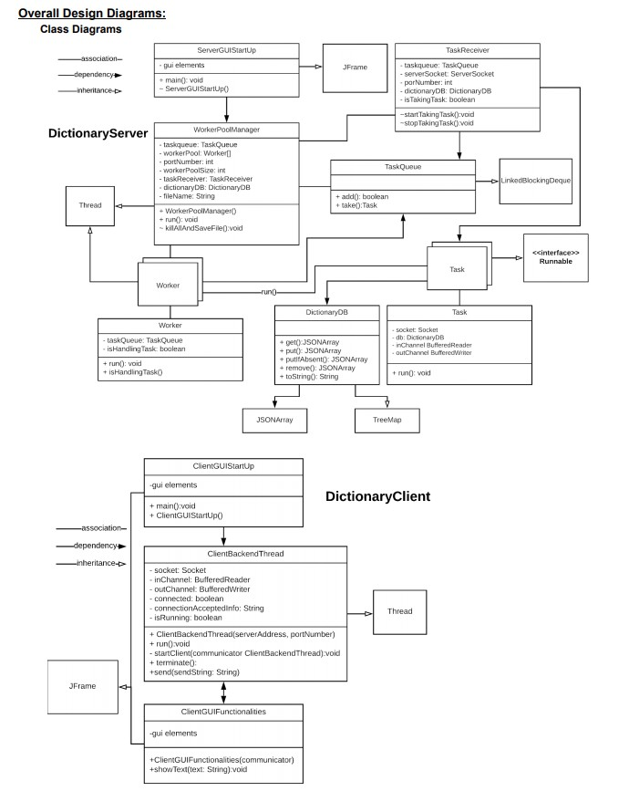
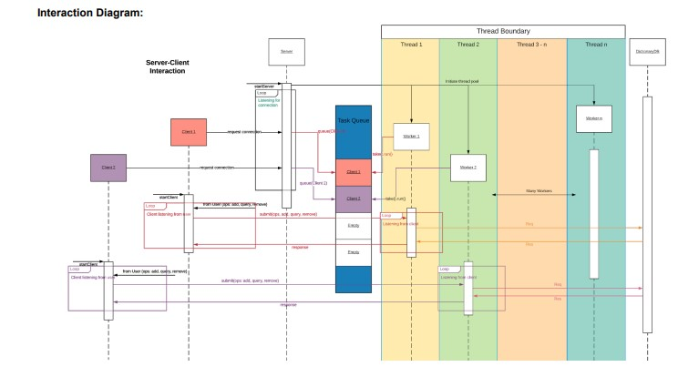
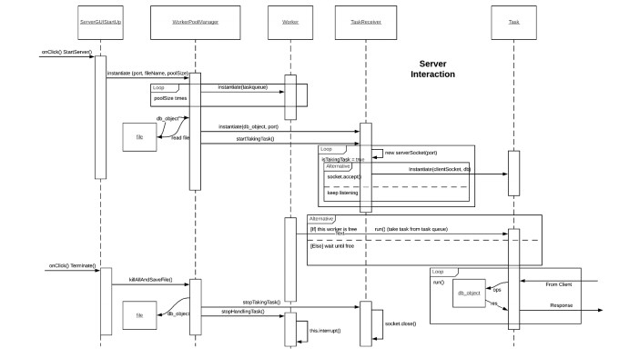
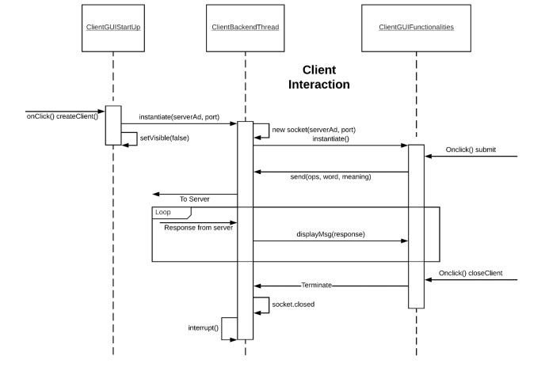

# This is a client server base online dictionary database app that allow multiple clients to query, update, and post to a dictionary server.
## keywords: TCP/IP sockets, Multithreading, Worker Pool Architecture

### The class diagram of this app 

### The Interaction diagram of this app
#### Overall

#### Server

#### Client

